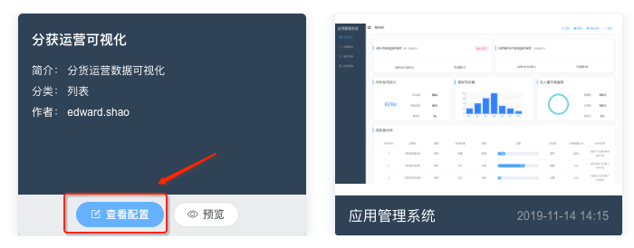

# 模板（Template)

若干区块与交互组成、满足某些特定功能的页面及页面的集合，例如：满足某个特定功能场景的增删改查页面，整个页面可以理解为模板，在物料市场中展示了很多模板示例 [>> 详情](/market/)

## 模板使用

第一步，创建一个html文件

```html
<!DOCTYPE html>
    <html>
    <head>
        <meta charset="utf-8">
        <title>首页</title>
        <link rel="stylesheet" href="https://h5rsc.vipstatic.com/ams/element-ui@2.11.1/theme-chalk/index.css" />
        <script src="https://h5rsc.vipstatic.com/ams/babel-polyfill/7.4.0/polyfill.min.js"></script>
        <script src="https://h5rsc.vipstatic.com/ams/vue@2.6.10.js"></script>
        <script src="https://h5rsc.vipstatic.com/ams/element-ui@2.11.1/index.js"></script>
        <script src="https://h5rsc.vipstatic.com/ams/ams@0.31.3.js"></script>
    </head>
    <body>
        <script>
           ams.block('template-block', {
             // 这里填入AMS模板的配置
           })
           ams.render('template-block')
        </script>
    </body>
</html>
```

第二步，在市场中选择合适项目的初始化模板，鼠标hover，可以看到“查看配置”的按钮，点开赋值里面的AMS配置，填充到第一步的html对应的注释配置里

